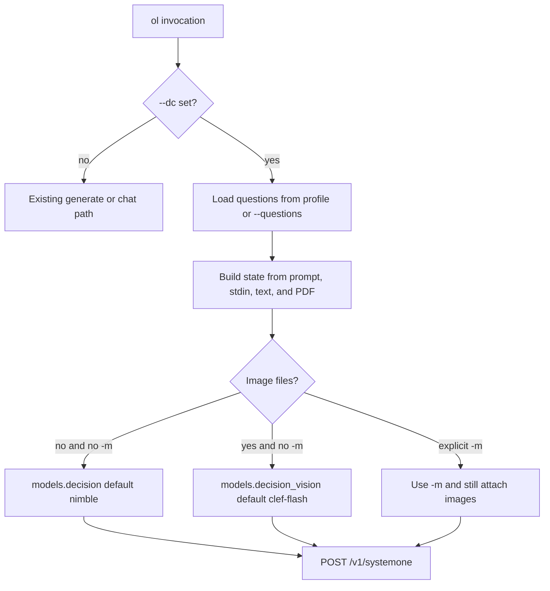

# Systemone decision mode

Status: **not started**. Recorded for later review. Do not treat this file as implemented behavior.

Ollama 0.35+ answers typed questions at `POST /v1/systemone`. The body matches the Python `ollama.systemone()` examples: `model`, `state`, `questions`, optional `images` (base64 PNG, JPEG, or WebP, shared by every question), and optional `keep_alive`. There is no prose and no temperature. `ol` keeps using `requests` directly, the same way `call_ollama_api` in `src/ol/cli.py` already posts to `/api/generate` and `/api/chat`.

No TypeSafe SDK and no `ollama` Python package. Inline one-off question flags stay out of this change. Profiles and `--questions` cover the Python examples.

## Routing

`--dc` / `--decision` never falls through to chat or generate. Images stay on the decision request as a top-level `images` array. That is separate from today’s vision path, which base64-encodes files and posts them to `/api/chat`.



Model and host selection mirrors the existing text/vision split in `run_ollama` and the type checks in `set_default_model` / `set_default_host`:

- No images and no `-m`: type `decision`, default model `nimble`.
- Any image and no `-m`: type `decision_vision`, default model `clef-flash`.
- `-m` always wins. Images are still attached. The server rejects a text-only model such as `nimble`.
- Host comes from `hosts.decision` or `hosts.decision_vision`. `-h` / `-p` still override for the current command.
- `-k` sends `keep_alive: -1`. `--temperature` with `--dc` is an error. The endpoint has no temperature field.

Decision vision accepts `.png`, `.jpg`, `.jpeg`, and `.webp`. Reuse the existing base64 read. Reject `.gif`, `.bmp`, and other extensions on this path with a message naming the three allowed formats. Leave the current chat allow-list (which rejects `.webp`) unchanged.

## State and questions

`state` is the text being judged:

- Positional prompt, `-f` prompt file, and stdin combine the same way they do today.
- Text files and extracted PDF text are appended, same as `run_ollama`.
- Image bytes go only in `images`, not into the state string.
- If the assembled text parses as a JSON object or array, send that value. Otherwise send a string. Image-only calls may send an empty string when the user gave no prompt.

Questions are required. Two sources, and using both is an error:

- `--dc PROFILE` loads `~/.config/ol/decisions/PROFILE.yaml` (or `.json`). The file is the `questions` object from the Python examples.
- `--questions FILE` loads that same object from an explicit path.
- `--dc` with neither a profile nor `--questions` prints an error and the profile directory.

Validate before the request: 1–64 questions; each has `type` of `choice`, `noul`, or `score` plus `instructions`; `choice` criteria is an object of 2–26 options; `score` criteria is a list of 2–26 levels; `noul` criteria is optional.

Example profile `~/.config/ol/decisions/greeting.yaml`:

```yaml
says_hello:
  type: noul
  instructions: Does the state text contain a greeting?
  criteria:
    "true": The state text contains a greeting.
    "false": The state text does not contain a greeting.
```

Usage:

```text
ol --set-default-model decision nimble
ol --set-default-model decision_vision clef-flash
ol --dc greeting "Hello World"
ol --dc greeting photo.webp
ol --decision --questions questions.yaml email.txt screenshot.png
cat ticket.txt | ol --dc triage
```

## Output

On a terminal, print one compact block per question: name, type, chosen value, and probabilities. With `--json`, or when stdout is not a terminal, print the raw response JSON. `-s` prints `usage` token counts. `-d` prints the URL and body with image payloads replaced by a length marker.

## Code touch points

- `src/ol/config.py`: add `models.decision` (`nimble`), `models.decision_vision` (`clef-flash`), and matching `hosts` entries to `DEFAULT_CONFIG`. Deep merge already fills these in for existing configs.
- `src/ol/cli.py`: flags `--dc`/`--decision` (optional profile) and `--questions`; extend the three `('text', 'vision')` checks and the completer to include `decision` and `decision_vision`. Do not add temperature for these types. New `call_systemone()` posts JSON and does not stream. Fork in `main()` before `run_ollama()`.
- Tests in `tests/test_cli.py` and `tests/test_config.py`, mocking `requests.post`: text state to nimble, image files to clef-flash with base64 `images` and no `/api/chat`, explicit `-m`, profile loading, validation errors, and `--json` output.
- Docs: `project_spec.md`, README help examples. Feature bump is minor when this lands (`pyproject.toml`, `src/ol/__init__.py`, `CHANGELOG.md`).

## Work slices

1. Add `decision` and `decision_vision` model/host defaults and accept them in `--set-default-model` and `--set-default-host`.
2. POST `/v1/systemone` with state, questions, optional base64 images, and `keep_alive`.
3. Add `--dc`/`--decision` profile and `--questions`, assemble state from prompt/files/stdin, and route images to `clef-flash`.
4. Mock-request tests for text, vision, validation, and JSON output; update `project_spec.md`, README, and version files.
